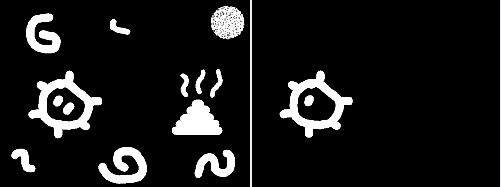

# Tarea 10

## Objetivos

- Programar un Clasificador Bayesiano Ingenuo para clasificar textos como **spam** o **no spam**.
- Programar la detección de componentes conexos en una imagen formato PGM en una imagen a escala de grises con fondo negro.

## Clasificador Bayesiano Ingenuo de Spam

Dado un conjunto de textos etiquetados como spam y no spam se debe construir un clasificador Bayesiano Ingenuo tal que pueda predecir la clase a la que pertenecerán nuevos textos.

La construcción del Clasificador Bayesiano Ingenuo es bajo la premisa que todas las variables aleatorias involucradas sin independientes. Así, dadas $K$ categorías y $x_1, x_2, ..., x_n$ muestras pertenecientes al conjunto de datos a clasificar podemos escribir el modelo de probabilidad dado por:
$$
\text{arg}\,\max\limits_{k \in \{1,2,..., k\}}\, p(C_k) \prod_{i=1}^{n}p(x_i | C_k)
$$
para alguna clase $C_k$, por tanto, el texto dado corresponde a la clase $C_k$ que tenga mayor probabilidad. Cabe notar que para nuestra tarea en especial nuestra solo tenemos 2 clases; spam y no spam.

Además, puesto que se realizan muchas multiplicaciones de probabilidades este calculo puede ser un poco problemático al implementarse en una computadora, usando logaritmos podemos reescribir la ecuación $(1)$ como un cociente:
$$
log_2(\frac{p(C_1|D)}{p(C_2|D)}) = log_2(\frac{p(C_1)}{p(C_2)}) + \sum_i log_2(\frac{p(w_i|C_1)}{p(w_i|C_2)})
$$
donde $C_1$ es la clase spam y $C_2$ es la clase no spam, $D$ es el documento en cuestión y $w_i$ es la i-ésima palabra del documento.

Así, si el cociente $log_2(\frac{p(C_1|D)}{p(C_2|D)}) > 0$ indica que el documento es spam de lo contrario no lo es.

Las medidas de predicción usadas para ver que tan bueno es el clasificador son las siguientes:

-   **Precision**: Medición del porcentaje de los resultados que son relevantes

$$
Precision = \frac{True\ positives}{True\ positives+ False\ Positives}
$$

-   **Recall**: Medición del porcentaje del total de resultados relevantes correctamente clasificados.

$$
Recall = \frac{True\ positives}{True\ positives+ False\ Negatives}
$$

-   **Accuracy**: Medición del porcentaje en el que acertó el modelo de clasificación

$$
Accuracy = \frac{True\ positives+True\ Negatives}{total}
$$

### Implementación y resultados

Usando las formulaciones descritas anteriormente se procedió a realizar un entrenamiento usando el conjunto de datos [SMS Spam Collection Dataset](https://www.kaggle.com/uciml/sms-spam-collection-dataset#spam.csv) obtenido desde [Kaggle](https://www.kaggle.com), el cual contiene un total de 5572 muestras donde 747 de ellas son están clasificadas como spam y 4825 como no spam.

Se procedió a dividir el conjunto datos en dos partes uno para entrenamiento y otro para validación, la tabla siguiente muestra las cantidades de datos para cada uno.

| Conjunto      | No. Spam | No. no spam | Total |
| ------------- | -------- | ----------- | ----- |
| Entrenamiento | 606      | 3966        | 4572  |
| Validación    | 141      | 859         | 1000  |
| Total         | 747      | 4825        | 5572  |

Los resultados obtenidos después del entrenamiento se muestran en la siguiente matriz de confusión:

|                |         | Valor Predicho |         |
| -------------- | ------- | -------------- | ------- |
|                |         | Spam           | No Spam |
| **Valor Real** | Spam    | 120            | 21      |
|                | No Spam | 54             | 805     |

Además se obtuvieron los siguientes medidas de predicción:

- **Precision**: 0.689655
- **Recall**: 0.851064
- **Accuracy**: 0.925

### Conclusiones 

A pesar de que a simple vista las muestras de las clases se encuentran bastante desbalanceadas, podemos observar que nuestro clasificador acertó en el 92.5% de los casos, dónde solo el 68.96% de los textos clasificados como spam en realidad si eran spam y 85.1% de los textos que son spam fueron clasificados correctamente como spam. A pesar de la simplicidad del método estamos obteniendo buenos resultados al predecir el texto usando solo dos clases, esto podría mejorarse realizando un preprocesamiento más exhaustivo sobre los datos antes de realizar el entrenamiento como por ejemplo usar un conjunto de datos de *stop_words*, y así omitir palabras no relevantes para nuestro entrenamiento como determinantes, pronombres, conjunciones, disyunciones, entre otros.

## Detección de Componentes Conexas en una imagen formato PGM

Dada una imagen en escala de grises dónde el fondo es de color negro y cuyos elementos son de color blanco, una forma de identificar cada uno de estos elementos es tratar de verlos y resolver el problema como una grafo con diversos componentes conexos.

De esta manera cada pixel puede ser tratado como un nodo con 8 pixeles vecinos. La idea consiste recorrer la imagen en búsqueda de algún pixel cuyo valor sea distinto de cero (lo que indica que este pixel debe pertenecer a algún elemento de la imagen) e iniciar algún algoritmo de recorrido ya sea DFS o BFS para visitar a sus 8 vecinos adyacentes repitiendo este procedimiento hasta terminar de recorrer la imagen.

### Implementación y resultados

En la implementación se decidió usar el algoritmo de recorrido DFS con una pequeña modificación para realizar el conteo de la cantidad de pixeles que conformar a dicho componente. Una vez obtenidos los componentes se escribe una copia de la imagen original únicamente con el componente más grande y el componente más pequeño.

A continuación se muestra la imagen de entrada (izquierda) y la imagen obtenida (derecha) después del procesamiento con el componente más grande y pequeño detectado.

### Conclusiones

Al igual que como se vio en clase, la implementación realizada detecta eficazmente los componentes de las imágenes planteadas, sin embargo cuando los elementos de las imágenes son más complejos, como podría ser que varios objetos pequeños pertenezcan o compartan información para formar un elemento más grande (por ejemplo el bichito de la primer imagen que parece que tiene dos ojos) o uno o más elementos se traslapan no logran ser reconocidos fielmente.
