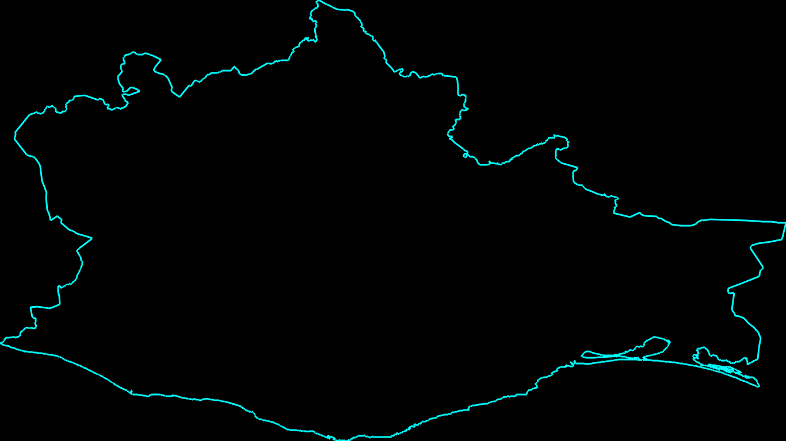
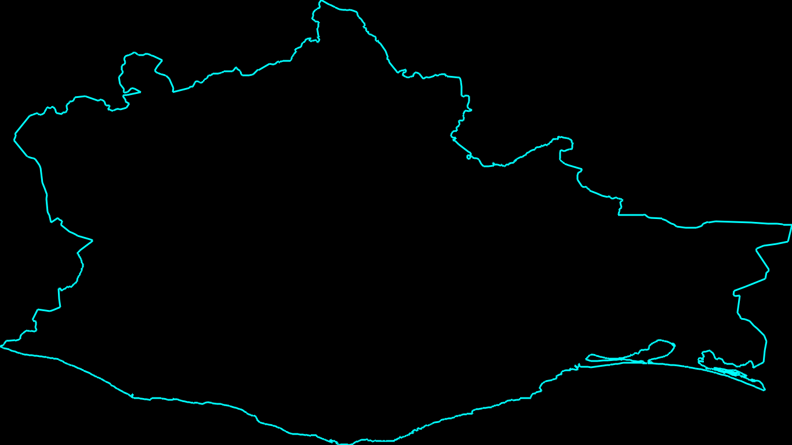
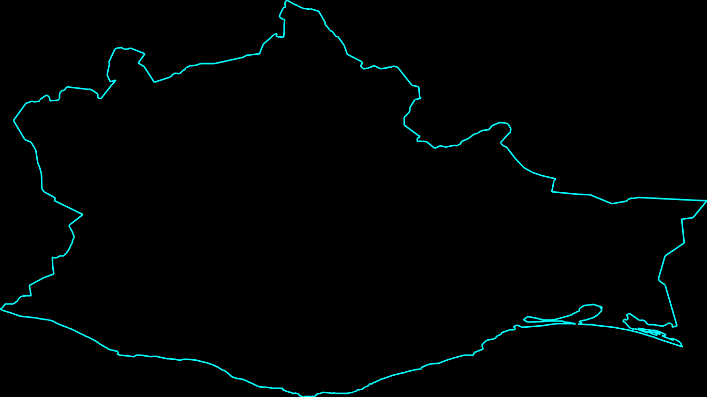

 

# Tarea 11 - Visvalingam algorithm

Oscar Esaú Peralta Rosales

## Objetivo

- Programar el Algoritmo de Visvalingam en el lenguaje C++ y mostrar los resultados a través del la biblioteca de Cairo

## Algoritmo de Visvalingam 

Esté algoritmo es usado para simplificar la geometría con el fin de representar de la mejor manera la misma figura sin perder la menor información posible, removiendo aquellos puntos cuya area formada por la tripleta conjunta con sus dos vecinos adyacentes es la menor, despues de remover el punto, se recalcula el area formada por los puntos vecinos afectados por la desaparición de este punto.

El algoritmo es el siguiente:

```
1. Calcular el área de cada punto (que conforma la mitad de la tripleta)
2. Borrar todos los puntos con área cero y almacenarlos en una lista con su área asociada.
3. Repetir hasta que solo haya dos puntos
	3.1 Encontrar el punto con el área menor. Si su área calculada es menor que la del último punto a eliminarse usar la última área. Esto asegura que el punto actual no será elminado antes de eliminar puntos anteriores. Eliminar el punto anterior de la lista original y agregarlo a una nueva lista junto con su área asociada.
	3.2 Recalcular el area de los puntos adyacentes.
```

## Implementación y Resultados

La figura de pruebas elegida fue la representación del estado de Oaxaca, con un total de **7279 puntos**, la siguiente imagen muestra la figura dibujada a través del uso de Cairo.


Con una compresión del 25% la imágen obtenida consta de 5460 puntos, el indice de Jaccard calculado es de 0.750069:



Con una compresión del 50% la imagen obtenida consta de 3641 puntos y un indice de Jaccard de 0.500137:



Con una compresión del 90% la imagen obtenida consta de 730 puntos y un indice de Jaccar de 0.100165:



## Conclusiones

A simple vista se observa que el algoritmo logra reproducir fielmente la imagen con una compresión de hasta del 90% conservando la estructura general de la misma. Es de notar que el nivel de compresión está sumamente ligada a la importancia de la perdida de información dependiendo de la aplicación del método.